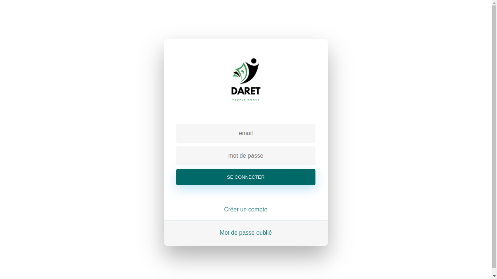
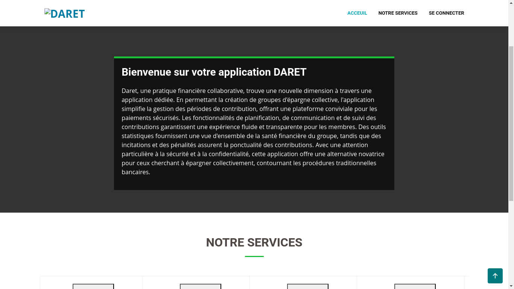
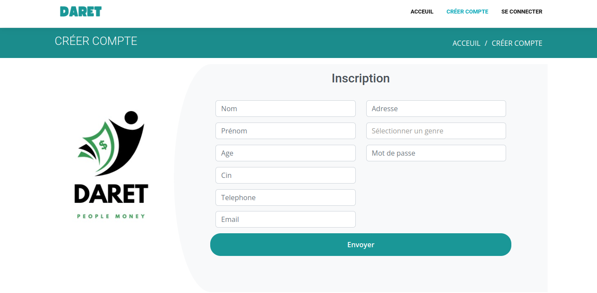
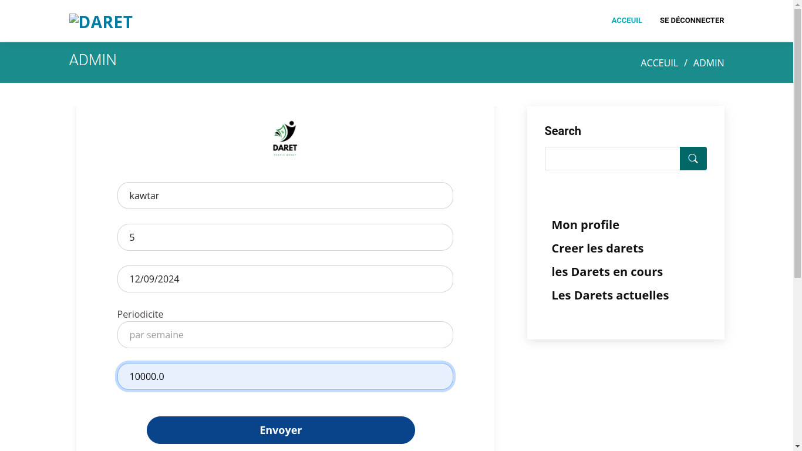
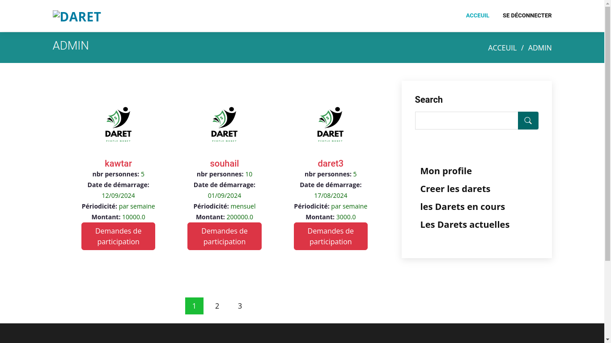

# 💰 Application Web de Gestion de Daret (Tontine)

## 📌 Présentation du projet

Ce projet consiste en la **conception et le développement d’une application web de gestion de Daret (Tontine)**.
La Daret est une opération financière collaborative permettant à un groupe de personnes d’épargner collectivement sans passer par les banques.

L’application permet de **créer, organiser et suivre des opérations de Daret en ligne**, tout en assurant la transparence des contributions, des périodes et du tour de rôle.

---

## 🎯 Objectifs

* Digitaliser la gestion des opérations de Daret
* Faciliter l’organisation des groupes et des tours de rôle
* Assurer un suivi clair des paiements et des périodes
* Offrir une interface simple et sécurisée aux participants

---

## ⚙️ Fonctionnalités principales

### 🔐 Authentification & Sécurité

* Connexion / Déconnexion
* Gestion des rôles (Admin / Participant)

### 👤 Gestion des utilisateurs

* Création et gestion des comptes utilisateurs
* Un utilisateur peut représenter plusieurs participations

### 💼 Gestion des Darets

* Création d’une Daret avec :

  * Nombre de participants
  * Date de démarrage
  * Périodicité (mensuelle, hebdomadaire, …)
  * Montant par période
  * Tour de rôle (manuel ou tirage au sort)

### 🔄 Gestion des tours de rôle

* Suivi du bénéficiaire de chaque période
* Historique des périodes passées
* Nombre de périodes restantes

### 💳 Gestion des participations

* Plusieurs utilisateurs peuvent partager un même montant
* Un participant peut cotiser pour deux parts ou plus
* Suivi des paiements par période

---

## 🧩 Cas particuliers supportés

* ✔️ Plus de participants que prévu (partage du montant)
* ✔️ Moins de participants (un participant cotise double)
* ✔️ Consultation en temps réel de l’état de la Daret

---

## 🛠️ Technologies utilisées

### Backend

* **Spring Boot**
* Spring MVC
* Spring Data JPA
* Spring Security
* Hibernate
* Base de données : MySQL / PostgreSQL

### Frontend

* **Thymeleaf**
* HTML5 / CSS3
* Bootstrap

### Outils

* Maven
* Git & GitHub
* IntelliJ IDEA / VS Code

---

## 🗂️ Architecture du projet

```
gestion-daret/
│── src/
│   ├── main/
│   │   ├── java/com/example/daret/
│   │   │   ├── controller/
│   │   │   ├── service/
│   │   │   ├── repository/
│   │   │   └── model/
│   │   └── resources/
│   │       ├── templates/
│   │       ├── static/
│   │       └── application.properties
│── README.md
│── pom.xml
```

---

## 📸 Captures d’écran

> 📁 Les images doivent être placées dans le dossier `/screenshots`

### 🔐 Page de connexion



### 🏠 home page


### ➕ Création d’un utilisateur


### ➕ Création d’une Daret




---

## 🧪 Exemple de Daret

* Nom : **Daret_10000**
* Nombre de participants : 10
* Montant par période : 1000 DH
* Périodicité : Mensuelle
* Montant reçu par période : 10 000 DH
* Tour de rôle : Tirage au sort
* Date de démarrage : 01/01/2024

---

## 🚀 Installation et exécution

```bash
# Cloner le projet
git clone https://github.com/username/gestion-daret-en-ligne.git

# Accéder au projet
cd gestion-daret-en-ligne

# Lancer l'application
mvn spring-boot:run
```

➡️ Accéder à l’application : `http://localhost:8080`

---

## 📈 Améliorations futures

* Notifications (email / SMS)
* Historique financier détaillé
* Tableau de bord analytique
* Application mobile

---

## 👩‍💻 Auteure

**Kawtar Souhail**
Étudiante en Master – Ingénierie des Systèmes Intelligents
Spécialisation : Développement Web & Intelligence Artificielle

---

## ⭐ Remerciements

Projet réalisé dans un cadre académique à des fins pédagogiques.

N’hésitez pas à ⭐ le repository si le projet vous plaît !
# gestion-daret
